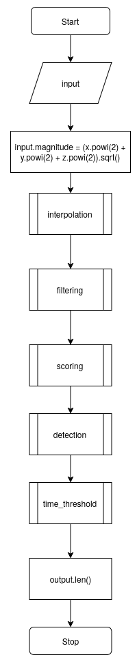
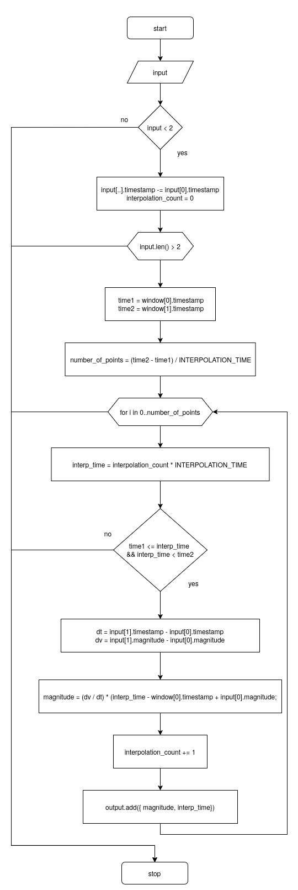
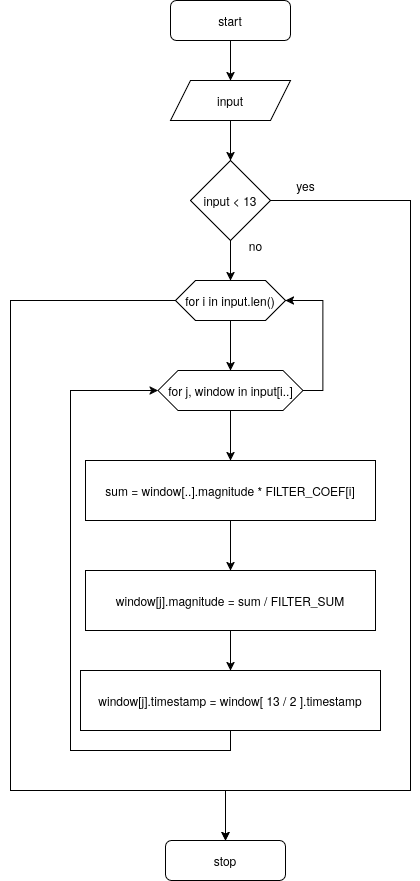
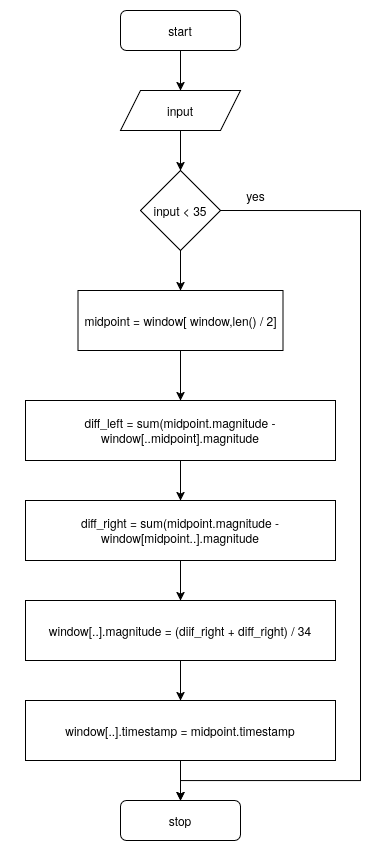
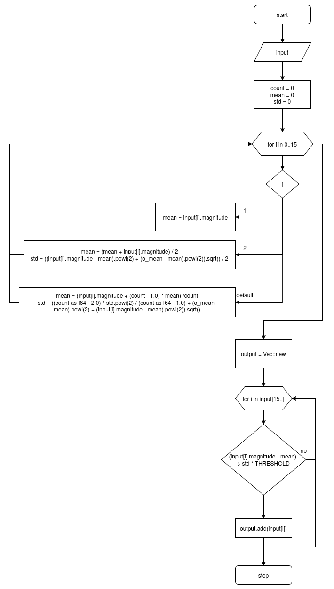
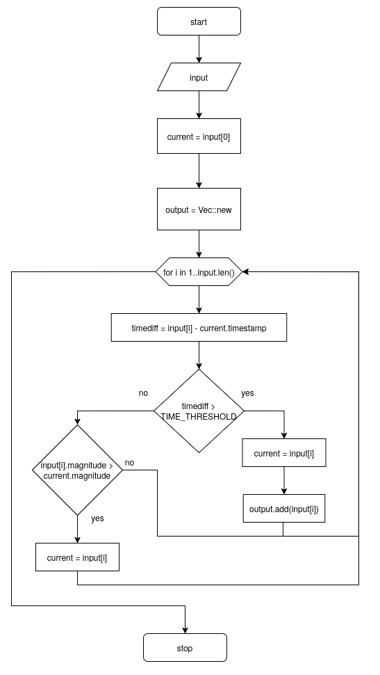

# Steps

Crate contains a step counter algorithm based on the Windowed Peak Detection method.

## Precision

Currently precision varies by person in existing dataset used to validate it. For wrist with accelerometer working in 25Hz it has following results:

| Precision | Count |
|-----------|-------|
| 80%       | 3     |
| 50%       | 6     |
| 20%       | 11    |
| <20%      | 19    |
| **Total** | **39**|

## Algorithm stages

- [Global](#global)
- [Interpolation](#interpolation-stage)
- [Filtering](#filtering-stage)
- [Scoring](#scoring-stage)
- [Detection](#detection-stage)
- [Time threshold](#time-threshold-stage)

### Global

### Interpolation stage

### Filtering stage

### Scoring stage

### Detection stage

### Time threshold stage

